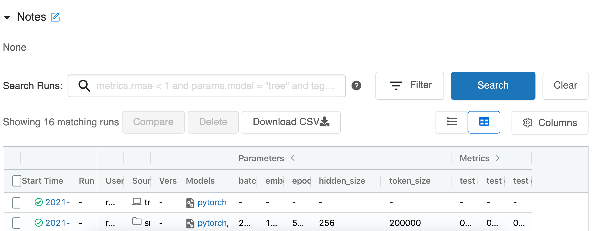
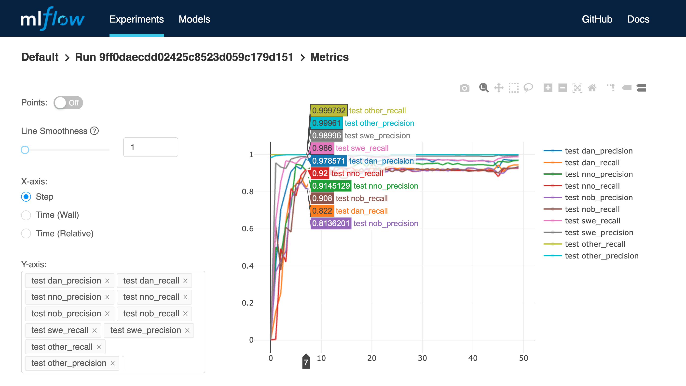
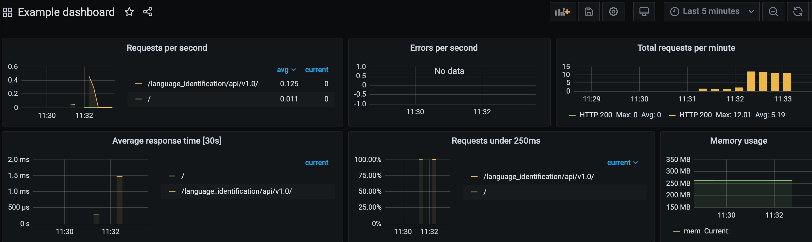

# Assignment

Implement a service which recieves a text input and returns if the text is in Danish, Swedish or Norwegian. It's required to use Pytorch, Docker, REST API.

# My solution

## Overview

1. Set up `MLFlow` in `Docker`.
2. Run several `MLFLow` experiments with `Pytorch LSTM`.
3. Store models and training metadata in `S3 bucket`.
4. Track test and validation metrics such as class precision and class recall.
5. Load the best experiment (model + metadata) for serving from `S3 bucket`.
6. Serve the experiment with `Flask API`.
7. Monitor API using `Prometheus`, `Grafana`.

Resulting metrics on [wili 2018](https://github.com/huggingface/datasets/tree/master/datasets/wili_2018) validation set:

|language|ISO 369-3 code|precision|recall|f1|
|---|---|---|---|---|
|Danish|dan|0.963|0.934|0.948|
|Swedish|swe|0.992|0.99|0.991|
|Nynorsk|nno|0.945|0.928|0.936|
|Bokmål|nob|0.923|0.91|0.916|

## Details

### Step by step

1. Run MLFlow on 5000, Flask API on 8080, Prometheus on 9090, Grafana on 3000.

```bash
$ ./build.sh
```

1. Train MLFlow experiments.

```bash
$ docker exec -it mlflow bash
$ mlflow run train --no-conda -P batch_size=128
```

3. Track MLFlow experiments.





4. Load the best experiment from S3 to Docker container for model serving. <br>
E.g. load experiment 0, run e9b1c8c553904e19b1a7b3564a1ee8cf, checkpoint 49.

```bash
$ docker exec -it serve bash
$ serve/download_model.sh -e 0 -r e9b1c8c553904e19b1a7b3564a1ee8cf -c 49.model
```

5. Send POST request to 8080.

```bash
$ curl -i -H "Content-Type: application/json" -X GET -d '{"text": "Savannen ligger i tropiske og subtropiske områder. Der vokser oftest enkeltstående buske og træer på savannen. Er der mange træer, kalder man det for en skovsavanne. I Afrika er der meget savanne, faktisk dækker savannen næsten halvdelen af Afrika, men der er også store savanner i Australien, Sydamerika og Indien."}' http://localhost:8080/language_identification/api/v1.0/

>> {
  "response":"Danish",
  "text":"Savannen ligger i tropiske og subtropiske områder. Der vokser oftest enkeltstående buske og træer på savannen. Er der mange træer, kalder man det for en skovsavanne. I Afrika er der meget savanne, faktisk dækker savannen næsten halvdelen af Afrika, men der er også store savanner i Australien, Sydamerika og Indien."
   }

```

```bash
$ curl -i -H "Content-Type: application/json" -X GET -d '{"text": "Саванны — климатические регионы, свойственные более возвышенным тропическим странам с сухим континентальным климатом. В отличие от настоящих степей, саванны, кроме трав, содержат также кустарники и деревья, растущие иногда целым лесом, как, например, в Бразилии."}' http://localhost:8080/language_identification/api/v1.0/

>> {
  "response": "Other", 
  "text": "Саванны — климатические регионы, свойственные более возвышенным тропическим странам с сухим континентальным климатом. В отличие от настоящих степей, саванны, кроме трав, содержат также кустарники и деревья, растущие иногда целым лесом, как, например, в Бразилии."
   }
```

6. Monitor with Prometheus, Grafana.



### ML training/serving pipelines consistency

Implementing an ML service consists of 2 major stages:
- training
- serving

These stages should be separated, because they are in essence different and can be performed by different people/teams, on different machines etc. But at the same time we want to use identical data preprocessing pipelines, identical model configs and so on.

I tried to convey that by using separate Dockerfiles and requirements.txt for training/serving, but I access the same preprocessing and prediction code from ./train.

Ideally we want to use development-test-staging-deployment environments for training and serving and check each part of our ML pipeline (data preprocessig, model parameters, prediction postprocessing, dependencies) with autotests  (like model checksums, identically preprocessed data for identical inputs etc). My setup is more simple but it can be easily managed in different environments by using different .env files and a config manager e.g. Terraform.

My pipeline consists of these parts:

- Text encoding, label encoding --> store encoders in S3 bucket,
- Text preprocessing code --> use the same code from ./train for training and serving,
- Model file, model parameters --> store model file and config in S3 bucket,
- Model output postprocessing --> use the same code from ./train for training and serving,
- Dependencies --> managed manually in requirements.txt.

I don't feel the need for autotests in this local setup, because I use identical code, identical encoders etc.

My .env includes these fields:

|key|value|
|---|---|
|MLFLOW_HOST|0.0.0.0|
|ARTIFACT_STORE|s3://mybucket/artifacts|
|AWS_SECRET_ACCESS_KEY|secret key|
|AWS_ACCESS_KEY_ID|key id|
|LOCAL_MODEL_STORAGE|artifacts|

### Data

I used [wili 2018](https://github.com/huggingface/datasets/tree/master/datasets/wili_2018) dataset because 1) it's a benchmark dataset for language identification 2) it consists of Wikipedia articles which cover a broad range of topics, so I believe the dataset is representative and generic 3) it's already very clean, no need for complex data preprocessors.

I train on 5 classes: Danish, Swedish, Nynorsk, Bokmål, Other. The dataset consists of `500 train` and `500 validation` samples per language for `235 languages`.

# References

1. [Approach to ML lifecycle, ML CI/CD](https://christophergs.com/machine%20learning/2020/03/14/how-to-monitor-machine-learning-models/)
2. [Guide to Mlflow with Docker](https://github.com/afranzi/mlflow-workshop)
3. [Guide to Flask API monitoring with Prometheus, Grafana](https://medium.com/swlh/generate-and-track-metrics-for-flask-api-applications-using-prometheus-and-grafana-55ddd39866f0)
4. [Pytorch LSTM for language identification](https://www.kaggle.com/jarfo1/lstm-baseline/notebook)
